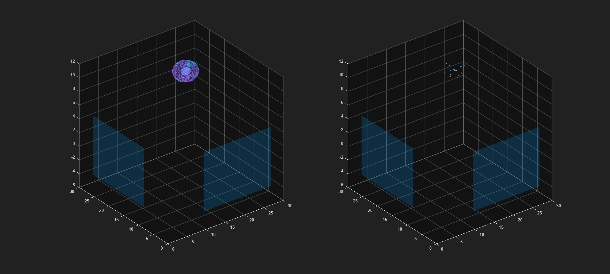

# Probabilistic Inference and Estimation using RFS for Coordinated Evasive Drones
----------------------------------------

An application of [BREW](https://github.com/Dawson-Pierce/brew) that implements advanced target tracking algorithms on drones. 

NOTE: This code is still in development and is in no way promised to perform to any specific standard. 

## Multi-Sensor Point Cloud Tracking of Simulated Drone: 
Trajectory Set Theory (TST) Gamma Gaussian Inverse Wishart (GGIW) applied to PHD filter for simulated point cloud measurements from two sensors.  

